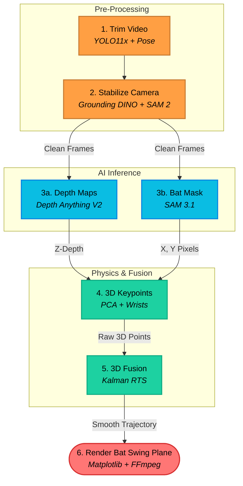

# 3D Cricket Bat Trajectory: Reconstructing the Swing Trajectory from Unstable 2D Video

*Extracting the precise 3D bat swing plane from a standard 2D video—no sensors, no multi-camera rigs, just AI.*

---

<!-- [IMAGE: Hero composite — raw video frame on left, 3D bat swing plane animation on right] -->

## Breaking the Hardware Barrier for 3D Swing Analysis

When analyzing a cricket shot, the most critical piece of data is the **3D bat swing plane**—the exact arc and angle the bat travels through space. Knowing the 3D bat swing plane immediately reveals if a player is slicing the ball, playing across the line, or coming down perfectly straight.

Because a swing happens in about 150 milliseconds, it is impossible for the human eye to track the exact 3D bat swing plane in real-time. To capture it, players rely entirely on specialized hardware:
- **Smart Sensors:** Players attach physical gyroscopic sensors to the handle of their bats (like StanceBeam or Blast Motion) to record their swing.
- **Biomechanics Labs:** Complex motion-capture studios use multiple infrared cameras to track reflective stickers pasted onto the bat.

While these hardware solutions are accurate, they are incredibly expensive, confined to specialized facilities, and intrusive—attaching a physical sensor alters the weight and feel of the bat.

This got me thinking: What if we didn't need hardware at all?

> **Can we reconstruct the exact 3D bat swing plane from a single, shaky 2D smartphone video using only AI models?**

The answer, it turns out, is yes—if you are willing to chain together multiple AI models, relative depth estimators, and physics-based filters.

---

## What We're Building: The Bat Swing Plane Pipeline

To solve this, I built the **Bat Swing Plane Pipeline**—an AI-driven system designed to reconstruct 3D trajectories from standard 2D videos of a cricket swing. 

Instead of relying on hardware markers or multiple cameras, the Bat Swing Plane pipeline processes the video through a series of key steps:

* **Step 1: Trimming & Stabilizing:** The pipeline finds the window of the swing, trims away the rest of the footage, and cancels out camera shake by locking onto the pitch's crease lines.
* **Step 2: Isolating the Bat:** It tracks and segments the bat in every frame, creating a pixel-perfect mask.
* **Step 3: Estimating Depth:** It generates a depth map for each frame, estimating how far the bat is from the camera to help recover the missing third dimension.
* **Step 4: Finding Keypoints in 3D:** It calculates the coordinates of the bat's handle and blade tip, combining them with the depth map to get raw 3D positions.
* **Step 5: Physics Smoothing & Rendering:** A physical motion model (a Kalman filter) smooths out depth noise and draws the swing path as a continuous 3D ribbon.

This pipeline runs locally on a consumer GPU, processing a typical trimmed video in about 30 seconds.

<!-- [VIDEO/GIF: The final side_by_side_4in1.mp4 output showing all 4 panels] -->

---

## The Architecture at a Glance

The pipeline is split into 6 stages. Here's the full stack:



All six models are loaded once (~10 seconds) and reused across every video. There is zero fine-tuning — every model is used off-the-shelf with its pretrained weights.

---

## Stage 1: Isolating the Active Swing

The input video clips are typically very short—around 1 to 2 seconds long. However, they often contain extra frames at the start or end where the batsman is out of frame or simply standing still. Stage 1 automatically crops the video in time, isolating *only* the active window where the shot is actually being played.

The pipeline processes each frame using two models simultaneously:
* **YOLO11x** detects the bat.
* **YOLOv8x-Pose** detects people and extracts their skeletal keypoints (like their wrists).

### Tracing the Batsman: Match Scores

If there are multiple people in the background (like a bowler, wicketkeeper, or coach), we cannot just pick the first person YOLO finds. We need to build a continuous "trace" (track) of each person across the frames. 

To do this, we compare every new person detected in a frame with the active tracks from previous frames. We assign detections to tracks by calculating a similarity score based on:
1. **Overlap (IoU):** How much the new bounding box overlaps with the track's last known position.
2. **Foot Placement:** The distance between the bottom of the bounding boxes, ensuring we don't match a standing player to someone running in the background.
3. **Body Proportions:** Matching the height-to-width aspect ratio of the boxes.
4. **Order:** Keeping track of who is on the left or right so we don't swap identities when people pass each other.

### Selecting the Active Swinger with Code

Once we have traced everyone's path across the video, we run a scoring function to identify which track belongs to the batsman playing the shot. 

Instead of relying on complex deep learning classifiers, we use a simple heuristic function to score each track:

```python
def score_track(track):
    bat_count = 0
    hands_score = 0.0
    avg_x = 0.0
    
    for frame_idx, person in track['frames'].items():
        box = person['box']
        avg_x += (box[0] + box[2]) / 2  # Keep track of center X coordinate
        
        # 1. Did this person overlap with a detected bat?
        if intersects_with_bat(box, detected_bats_in_frame):
            bat_count += 1
            
        # 2. Are the wrists visible and close together?
        if person.has_wrists:
            hands_score += 1000.0 / (person.wrist_distance + 1.0)
            
    n = len(track['frames'])
    avg_x /= n  # Average horizontal position of the player
    
    # Score formula balancing bat interaction, hands, length, and position
    return (bat_count * 100) + hands_score + n - abs(avg_x - FRAME_CENTER_X)
```

This code uses four simple factors to find the batsman:
* `bat_count * 100`: Massive points for being near a bat.
* `hands_score`: Points for having the left and right wrists close together (which happens when holding a bat).
* `n`: Points for staying in the frame longer.
* `- abs(avg_x - FRAME_CENTER_X)`: A penalty for being far away from the center of the screen (which filters out background coaches or keepers standing on the sidelines).

The track with the highest score is crowned the batsman, and we trim the video to start and end right around their swing. Any brief gaps where the batsman was lost are filled in using linear interpolation (connecting the dots). This trims the clip down to just the ~25 frames of pure action, saving huge amounts of processing time later.

<!-- [IMAGE: Frame timeline showing bat detection confidence, with the selected block highlighted] -->

---

## Stage 2: Killing the Camera Shake (Pitch Stabilization)

This is the stage that makes everything else possible. Without it, the entire pipeline falls apart.

When someone records a cricket shot, the camera naturally pans, tilts, or zooms to follow the action. This means the bat's position on the screen shifts from frame to frame even if the batsman is standing perfectly still. If you try to project these moving camera coordinates straight into 3D space, you get chaotic, noisy data.

The solution is to lock the video's coordinate system to something that never moves: the cricket pitch.

Every pitch has two white crease lines painted on the ground (the bowling and batting creases). If we can locate these lines in every frame, we can warp the video so that the crease lines always sit in the exact same pixel positions. 

### Finding the Lines with Zero Training Data

To find these lines without training a custom model, we use **Grounding DINO**—an object detection model that understands English. We feed it a simple text query:

```text
"the vertical white line . white boundary line"
```

Even though Grounding DINO wasn't trained specifically on cricket pitches, it locates the white lines on the ground. Once it finds them in a single "golden frame," we feed those locations into **SAM 2** (Segment Anything Model 2). SAM 2 is designed for video; we give it a few points on the lines, and it automatically tracks and outlines the shapes of those crease lines forward and backward through the entire clip.

<!-- [VIDEO: Unstabilized raw video overlaid with SAM 2 crease line detection masks] -->

### Warping the Coordinate Space

Once SAM 2 gives us the pixel coordinates of the left and right crease lines for every frame (`left_x` and `right_x`), we lock them in place using a geometric transformation.

Here is the exact code that calculates the warp matrix:

```python
# Calculate scale so the pitch width matches our 1280x1280 target template
scale = TARGET_PITCH_W / max(10, right_x - left_x)

# Create an Affine Transformation Matrix to shift and scale the frame
M = np.float32([
    [scale, 0, TARGET_LEFT_X - left_x * scale],
    [0,     scale, TARGET_LINE_Y - left_y_top * scale]
])

# Warp the frame, effectively stretching it like a rubber sheet 
out_frame = cv2.warpAffine(frame_copy, M, (1280, 1280))
```

This mathematical "rubber sheet" transformation normalizes every frame. The camera movement is completely neutralized, and the pitch is locked in place. Any movement left in the video is now the true physical motion of the player and the bat.

<!-- [IMAGE: Before/after — raw shaky frame vs. stabilized frame] -->

---

## Stage 3a: Seeing Depth from a Single Camera

A standard video captures a flat 2D image without a Z-axis. But we need depth to reconstruct a 3D trajectory.

To recover this missing dimension, we use **Depth Anything V2 Large**, a state-of-the-art transformer trained on millions of images to predict relative depth. It doesn't give us absolute distances in meters, but it calculates exactly which pixels are closer to the camera and which are farther away.

### The "Edge Hardening" Hack

Here is a common problem with monocular depth models: thin, fast-moving objects (like a cricket bat swinging at high speed) often blend into the background. The AI thinks the bat is part of the grass, ruining the 3D data.

To fix this, before we feed the video to the depth model, we use classic computer vision to artificially "harden" the edges of the bat. By running the frames through Contrast Limited Adaptive Histogram Equalization (CLAHE) and an Unsharp Mask, we artificially draw borders around objects:

```python
# 1. Boost saturation (makes the bat pop against the grass)
# 2. Apply CLAHE (Contrast Equalization for structural clarity)
# 3. Unsharp Mask (Mathematical Edge Hardening)
gaussian = cv2.GaussianBlur(clahe_bgr, (0, 0), sigma=1.5)
sharpened = cv2.addWeighted(clahe_bgr, 2.5, gaussian, -1.5, 0)
```

This forces the AI to recognize the bat as a distinct object floating above the pitch.

Once the model processes these sharpened frames, it outputs a "disparity map" (where higher values mean closer). We invert this to get our final relative depth map, making sure to zero out the black padding added during the stabilization stage so it doesn't corrupt our 3D math:

```python
# Convert disparity to relative depth
depth_map = 1.0 / (depth_map + 1e-6)

# Zero out the black borders generated in Stage 2
black_mask = np.all(raw_frame == 0, axis=-1)
depth_map[black_mask] = 0.0
```

<!-- [IMAGE: RGB frame alongside its TURBO-colormapped depth map] -->

---

## Stage 3b: The Bat vs. Wicket War

This is where the real engineering happened.

**SAM 3.1 Multiplex** is a massive video segmentation model that can track objects across frames with remarkable consistency. You give it a text prompt like `"bat"` and it finds the bat in one frame and tracks it through the entire video.

Except, it doesn't just find the bat. It also finds the wicket stumps. 

To a segmentation model, a cricket bat and wicket stumps look nearly identical: long, thin, vertical objects made of wood. In early experiments, when prompted to find the "bat," SAM would confidently highlight the wicket stumps as well, treating them as if they were bats.

### The Dual-Session Subtraction Trick

The fix is to run SAM twice in two separate sessions, and then use logical subtraction to clean the masks. 

```python
# Session 1: Track the bat (which SAM often confuses with stumps)
bat_out = run_session(sam, pil_frames, prompt="bat", frame=actual_bat_frame)

# Session 2: Track the wickets explicitly
wkt_out = run_session(sam, pil_frames, prompt="wicket", frame=actual_wicket_frame)

# The Core Subtraction: Keep bat pixels ONLY IF they are not wicket pixels
clean_masks = {f: bat_masks[f] & ~wkt_masks[f] for f in all_fidxs}
```

### Filtering with the "Wicket Zone"

Even after subtraction, tiny fragments of the stumps might remain. To completely eliminate this noise, we compute a **Wicket Exclusion Zone**—a bounding box that averages the position of the stumps across all frames. 

```python
# Create an average bounding box around all detected wicket masks
wkt_zone = compute_wicket_zone(wkt_masks, all_fidxs)
```

For every remaining blob in our `clean_masks`, we check its size and position. If a blob falls inside the `wkt_zone` and is smaller than 40% of the main bat's area, we instantly delete it.

Finally, we enforce temporal continuity. If multiple blobs survive in a single frame, we pick the blob whose center is closest to the bat's center from the previous frame. This prevents the tracker from randomly jumping from the bat to background noise.

This dual-session approach isn't cricket-specific. It's a general computer vision technique: whenever an AI confuses two similar objects, track both and subtract!

<!-- [IMAGE: Side-by-side — raw bat mask with stumps contamination vs. clean mask after subtraction] -->

---

## Stage 4: Turning a Blob into a Vector (The PCA Hack)

At this point, we have a clean, perfectly tracked binary mask of the bat in every frame. But a mask is just a blob of white pixels. To reconstruct a 3D trajectory, we need the exact X, Y coordinates of two specific points: the **handle** (where the batsman grips) and the **blade tip** (the far end of the bat).

### Finding the Bat's Axis with PCA

How do you find the geometric ends of an irregular blob? You use **Principal Component Analysis (PCA)**. 

By treating the white pixels of the mask as a 2D scatter plot, PCA calculates the "line of best fit" straight through the center of the bat.

```python
# Get all the (X, Y) pixel coordinates from the bat mask
ys, xs = np.where(bat_mask)
cx, cy = xs.mean(), ys.mean()

# Shift points to the center and calculate the covariance matrix
pts = np.column_stack([xs - cx, ys - cy])
cov = (pts.T @ pts) / len(pts)

# The eigenvectors tell us the geometric axes of the blob
eigvals, eigvecs = np.linalg.eigh(cov)

# The eigenvector with the largest eigenvalue is our bat's major axis!
major_axis = eigvecs[:, 1]  
```

If we project our pixels along this `major_axis`, we find the two extreme endpoints of the bat. 

But there is a catch: math doesn't know which end is the handle and which end is the tip!

### Wrist Tracking for Classification

To solve this, we bring back **YOLOv8-Pose**. We use it to detect the batsman's wrists (COCO keypoints 9 and 10). We calculate the midpoint between the left and right wrists to find the player's grip.

The endpoint of the bat's axis that is closest to this grip is classified as the **handle**. The opposite end is the **blade tip**.

**The Width Tiebreaker:** What happens if the batsman's hands are blocked from the camera's view? We fall back on a structural rule: a cricket bat's blade is significantly wider than its handle. We count the pixels at both ends of the axis. The end with the higher pixel density is crowned the tip.

Finally, to get sub-pixel accuracy, we don't just use the single furthest pixel. We take the average (center of mass) of the top 15% and bottom 15% of pixels along the axis. This prevents a single jagged, noisy pixel from causing the tracked tip to jitter!

<!-- [IMAGE: PCA axis overlaid on bat mask, with tip and handle endpoints marked] -->

---

## Stage 5: The Mathematical Heart (3D Fusion and Kalman Smoothing)

Now we have, for each frame:
- The exact 2D coordinates (X, Y) of the blade tip and handle (from Stage 4).
- A dense relative depth map of the scene (from Stage 3a).

By sampling the depth map at the (X, Y) location of our keypoints, we extract their Z-coordinates. We now have raw 3D observations of the cricket bat!

But there is a major problem: these observations are incredibly noisy. Because monocular depth models predict depth frame-by-frame, they have no temporal consistency. The depth of the bat might flicker wildly between frames. Furthermore, if the bat crosses behind the batsman's body, we get no observation at all.

### Filtering the Noise: Depth Outlier Rejection

Before doing any advanced math, we filter out impossible depth values. For every frame, we calculate the mean ($\mu$) and standard deviation ($\sigma$) of the entire scene's depth. Any Z-coordinate that falls outside $\mu \pm 3\sigma$ is immediately discarded as a model hallucination. We also discard any keypoints that fall into the pure-black padding added during stabilization.

### The 9-State Kalman RTS Smoother

To turn these noisy, gap-filled observations into a silky-smooth 3D trajectory, I use a **Rauch-Tung-Striebel (RTS) smoother** — a two-pass extension of the Kalman filter.

The state vector tracks position, velocity, and acceleration in all three dimensions:

$$X_t = [x, y, z, \dot{x}, \dot{y}, \dot{z}, \ddot{x}, \ddot{y}, \ddot{z}]^T$$

The constant-acceleration transition matrix (`F`) looks like this in the code:

```python
# 9-State Transition Matrix (Position + Velocity + Acceleration)
F = np.array([
    [1, 0, 0, 1, 0, 0, 0.5, 0,   0  ],
    [0, 1, 0, 0, 1, 0, 0,   0.5, 0  ],
    [0, 0, 1, 0, 0, 1, 0,   0,   0.5],
    [0, 0, 0, 1, 0, 0, 1,   0,   0  ],
    [0, 0, 0, 0, 1, 0, 0,   1,   0  ],
    [0, 0, 0, 0, 0, 1, 0,   0,   1  ],
    [0, 0, 0, 0, 0, 0, 1,   0,   0  ],
    [0, 0, 0, 0, 0, 0, 0,   1,   0  ],
    [0, 0, 0, 0, 0, 0, 0,   0,   1  ]
])
```

**Why 9 states instead of 3?** A bat swing isn't constant velocity. It accelerates heavily through the downswing, reaches peak speed at impact, and violently decelerates during the follow-through. A standard position-only Kalman filter assumes straight-line motion during occlusions. By giving the filter acceleration states, it can accurately predict curved, swooping trajectories even when the bat is hidden for several frames.

The RTS smoother runs two passes over the data:
1. **Forward pass:** Standard Kalman filtering, estimating the state using only *past* observations.
2. **Backward pass:** The RTS equations sweep backward in time, correcting the forward estimates using *future* observations.

This means if the bat disappears behind the batsman's leg for 3 frames, the smoother uses the frames before *and* after the occlusion to perfectly infer where the bat was, producing a flawless, unbroken 3D curve.

## Stage 6: The 3D Animation

Now that we have a mathematical trajectory, it's time to visualize it.

The final trajectory is rendered as a **ruled-surface ribbon**—a continuous 3D shape representing the "swept plane" of the bat face. For every frame, the code draws a quadrilateral connecting the previous positions of the tip and handle to their current positions. 

To give an intuitive sense of the bat moving toward or away from the camera, the ribbon is colored using a violet-to-yellow depth gradient.

```python
# Create the 3D surface connecting the tip and handle across time
quad_z = (z_handle[:n-1] + z_handle[1:n] + z_tip[:n-1] + z_tip[1:n]) / 4.0
z_norm = (quad_z - quad_z.min()) / (quad_z.max() - quad_z.min() + 1e-9)

for i in range(n - 1):
    # Color the mesh based on the depth (Z-axis) of the bat
    rgba = (*ribbon_cmap(z_norm[i])[:3], RIBBON_ALPHA)
```

The leading edge of the bat is marked with two bright dots (the tip and handle) connected by a solid white line to show its exact orientation at the current millisecond.

### Fast Parallel Rendering

Rendering 3D plots in Matplotlib is notoriously slow. To get around this without writing custom OpenGL code, the pipeline parallelizes the rendering process across all available CPU cores using Python's `ProcessPoolExecutor`. 

```python
with concurrent.futures.ProcessPoolExecutor() as executor:
    # Render all frames for 3 different camera angles simultaneously
    for idx, (elev, azim) in enumerate(TRAJ_VIEW_ANGLES):
        list(executor.map(_render_frame, args_list))
        
        # Stitch the frames into a fast MP4 video
        subprocess.run(["ffmpeg", "-y", "-i", "frame_%04d.png", "-c:v", "libx264", ...])
```

By rendering from three different camera angles (e.g., top-down, side-profile, and standard view) simultaneously, we get a comprehensive 3D view of the trajectory in seconds rather than minutes.

<!-- [IMAGE: A single 3D rendered frame showing the ribbon, blade line, dots, and depth colorbar] -->

---


## Results: 60 Videos, Zero Failures

I tested the pipeline on a batch of 60 cricket videos covering a range of shot types—cover drives, pull shots, cuts, flicks, defensive blocks, and lofted shots—from both left-handed and right-handed batsmen. The videos were filmed on standard mobile phones at varying angles and distances.

| Metric | Value |
|--------|-------|
| Videos processed | 60 / 60 |
| Success rate | 100% |
| Average processing time | ~10 seconds / video |
| Average frames per clip | ~24 (trimmed) |
| Bat mask detection rate | ~95% of frames |
| Valid 3D depth observations | ~93% of frames |
| Kalman gap-fills needed | Median 1 frame / video |

The pipeline successfully handles:
- Different camera angles (behind the bowler, side-on, slightly elevated)
- Different lighting conditions (bright sun, overcast, indoor nets)
- Both left-handed and right-handed batsmen (the PCA + wrist system is completely hand-agnostic)
- Partial bat occlusion during the backswing or follow-through

<!-- [GALLERY: 4-6 side-by-side results showing different shot types] -->

---

## What Went Wrong (Lessons Learned)

No engineering project is complete without a list of things that broke along the way.

### SAM Tracking the Wrong Object
In early versions, SAM 3.1 locked onto the wicket stumps instead of the bat in ~20% of videos. The stumps and bat are both long, thin, wooden objects. The dual-session subtraction trick (Stage 3b) solved this completely.

### Camera Shake Corrupting Depth
Without pitch stabilization, the sampled Z-coordinates drifted wildly between frames. The bat hadn't moved in the real world, but the *camera* had moved—shifting the bat to a different part of the depth map and giving it a different relative depth. Stabilizing the footage to the crease lines (Stage 2) eliminated this class of error entirely.


---

## The Full Model Stack (Zero Fine-Tuning!)

One of the most impressive parts of this pipeline is that it requires **zero fine-tuning**. I didn't train a single model on a custom cricket dataset. Every single one of these massive foundation models is running completely zero-shot.

| Model | Parameters | Size | Role |
|-------|-----------|------|------|
| YOLO11x | ~57M | 115 MB | Object detection (bat, person) |
| YOLOv8x-Pose | ~69M | 139 MB | Human pose estimation (wrists) |
| Grounding DINO Tiny | ~170M | ~350 MB | Zero-shot text-prompted detection |
| SAM 2 Hiera Large | ~200M | 898 MB | Promptable image segmentation |
| SAM 3.1 Multiplex | ~1.2B | 3.5 GB | Video object segmentation |
| Depth Anything V2 Large | ~335M | ~1.3 GB | Monocular depth estimation |

**Total VRAM footprint:** All models are loaded into memory once and share the GPU context. Because they are running zero-shot inference rather than training, the entire pipeline runs comfortably on a single GPU with 12 GB of VRAM, processing each video in just ~10 seconds!


## Try It Yourself

The full source code, model weights, and test videos are available on GitHub.

```bash
# Clone and setup
git clone https://github.com/[username]/batplane.git
cd batplane
conda activate ml
pip install -r requirements.txt

# Process a single video
python run_single.py --input your_cricket_video.mp4

# Batch process a folder
python run_batch.py --input-dir ./your_videos/ --output-dir ./results/
```

The pipeline is configured through a single `config.py` file containing over 150 tunable constants — everything from YOLO confidence thresholds to Kalman filter noise parameters. If something doesn't work on your videos, the fix is almost certainly a config tweak, not a code change.

---

## References

1. Ultralytics YOLO — https://docs.ultralytics.com/
2. Segment Anything Model 2 (SAM 2) — https://github.com/facebookresearch/segment-anything-2
3. Depth Anything V2 — https://huggingface.co/depth-anything/Depth-Anything-V2-Large-hf
4. Grounding DINO — https://github.com/IDEA-Research/GroundingDINO
5. Rauch, H. E., Tung, F., and Striebel, C. T. (1965). *Maximum Likelihood Estimates of Linear Dynamic Systems.* AIAA Journal.
6. OpenCV — https://docs.opencv.org/

---


