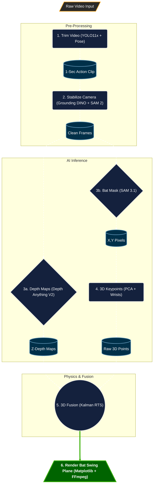
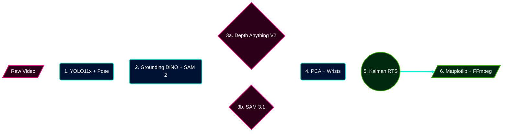
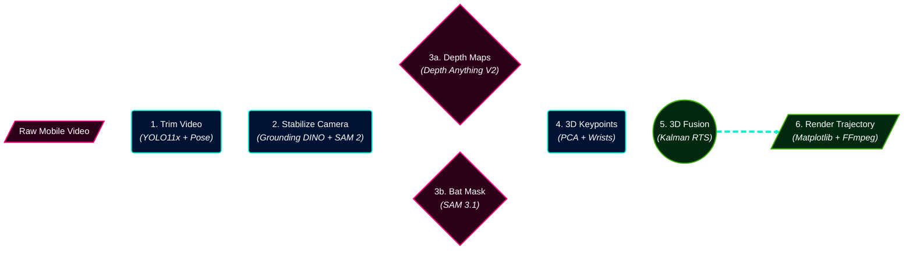
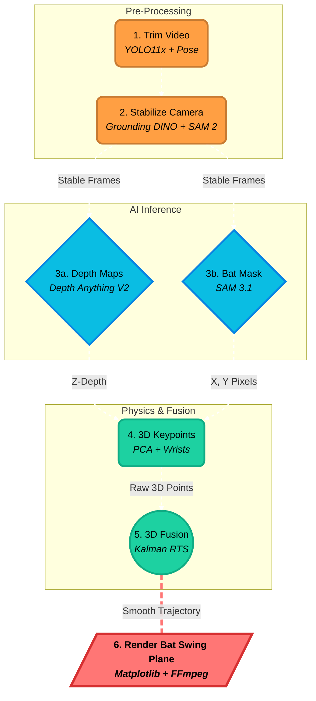
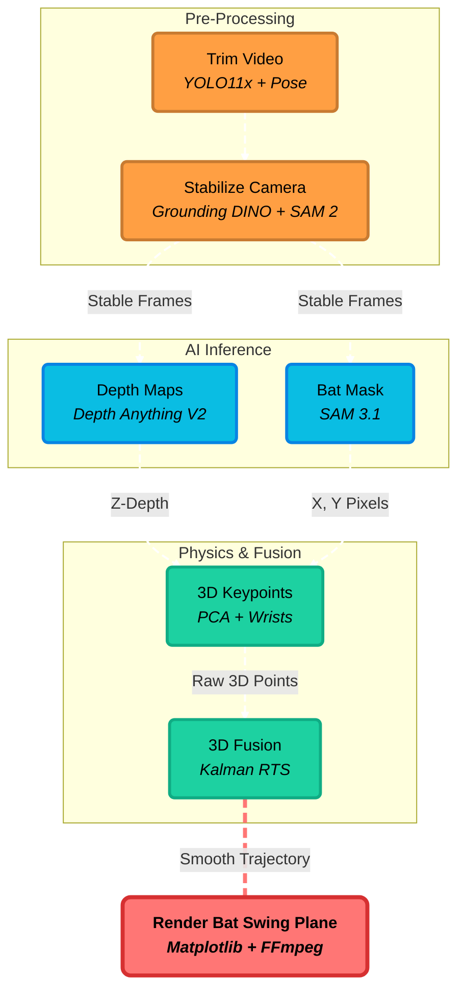

# Pipeline Diagram Options

Here are upgraded, premium-styled Mermaid diagrams for the Bat Swing Plane Pipeline. They use custom colors, rounded corners, and shapes to look significantly better than the default basic layout! 

*(Note: GitHub Markdown does not support standard CSS keyframe animations inside SVGs for security reasons. However, I have applied the `stroke-dasharray` technique which gives the connecting lines a dashed, "moving data" look in supported markdown renderers!)*

### Option 1: The "Premium" Dark Mode Flow
*Features custom hex colors, rounded corners, and drop shadows to look like a modern system architecture.*

---

### Option 2: The "Neon" Horizontal Layout
*Uses bright, high-contrast neon styling for a cyberpunk/AI feel, laid out left-to-right.*

---

### Option 3: The "Cyberpunk Detailed" Horizontal Layout
*An upgraded version of Option 2 that explicitly lists the technical models used at each step, ensuring perfect context for the pipeline while maintaining the premium neon aesthetic.*

---

### Option 4: The "Original Diagram" Upgraded
*This layout keeps the exact same structure as the original diagram in your blog draft (grouped by Pre-Processing, AI Inference, Physics), but significantly upgrades the visuals with bright colors, 3D shapes, and dashed flow paths (no emojis).*

---

### Option 5: The Uniform Layout
*This version uses the exact text and flow from Option 4 but simplifies all shapes into clean rectangles. The animation style uses the dashed strokes from Option 3, and the flow goes top-to-bottom.*

