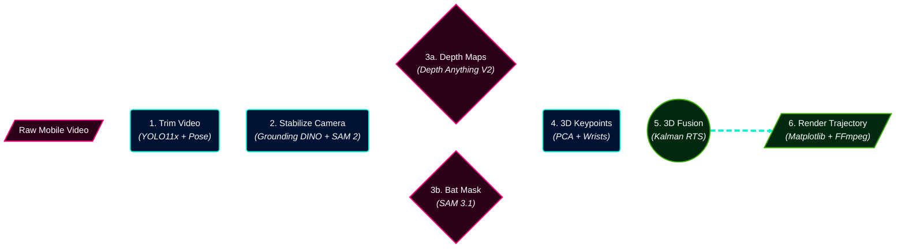
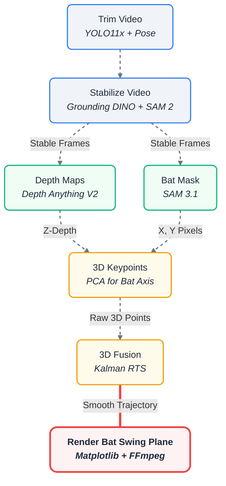
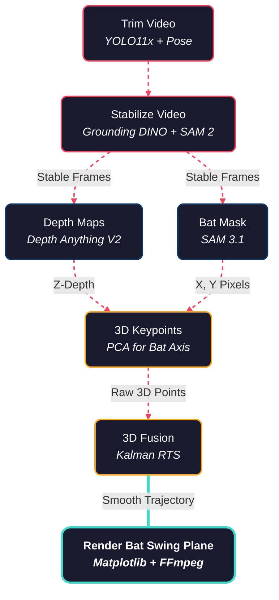
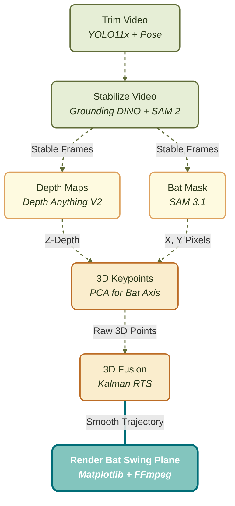
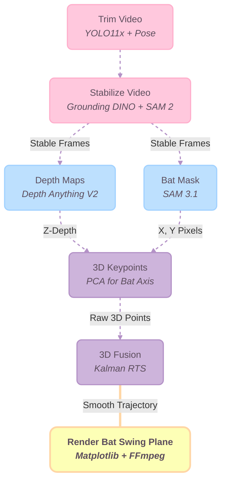
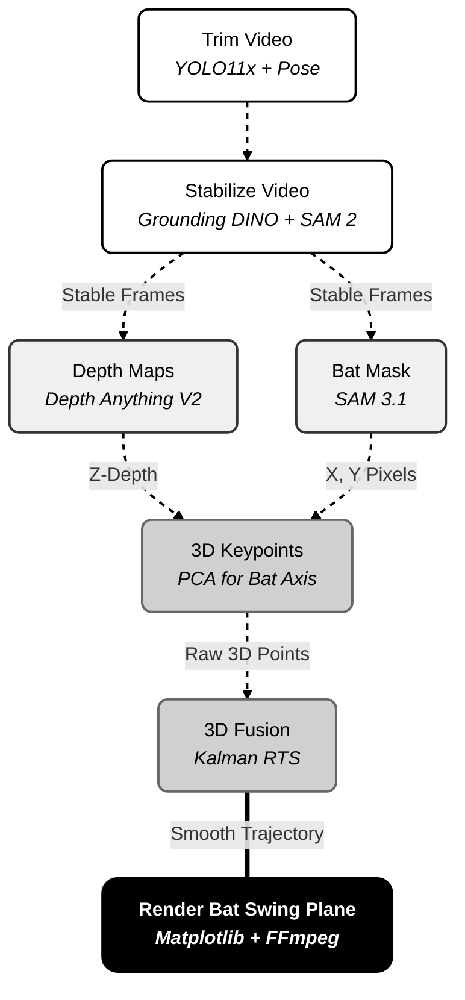
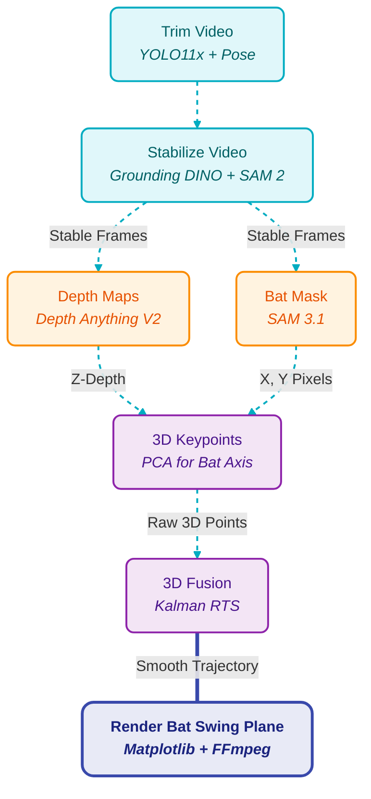
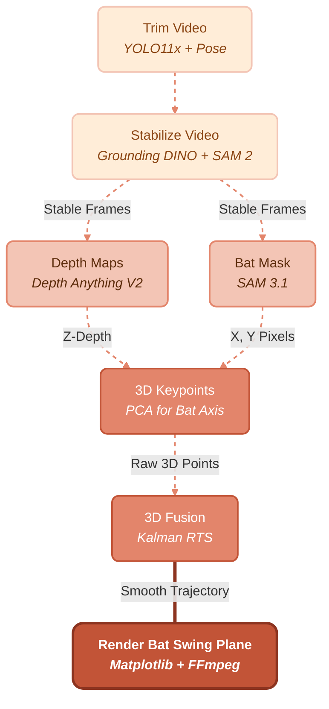
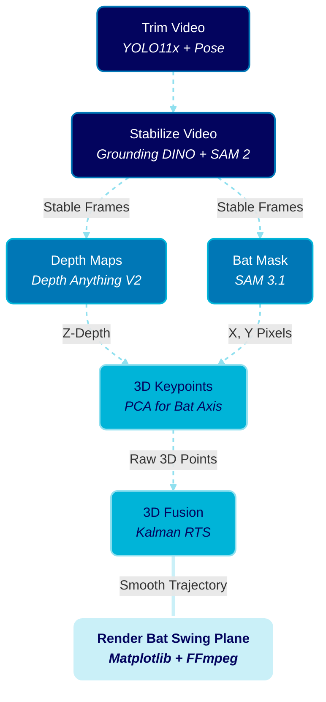

<!-- # Pipeline Diagram Options

Here are upgraded, premium-styled Mermaid diagrams for the Bat Swing Plane Pipeline. They use custom colors, rounded corners, and shapes to look significantly better than the default basic layout! 

*(Note: GitHub Markdown does not support standard CSS keyframe animations inside SVGs for security reasons. However, I have applied the `stroke-dasharray` technique which gives the connecting lines a dashed, "moving data" look in supported markdown renderers!)*

### Option 1: The "Premium" Dark Mode Flow
*Features custom hex colors, rounded corners, and drop shadows to look like a modern system architecture.*

```mermaid
flowchart TD
    %% Custom Styles
    classDef input fill:#2b2b2b,stroke:#fca311,stroke-width:2px,color:#fff,rx:10px,ry:10px;
    classDef stage fill:#14213d,stroke:#e5e5e5,stroke-width:2px,color:#fff,rx:5px,ry:5px;
    classDef data fill:#003049,stroke:#669bbc,stroke-width:2px,color:#fff,rx:15px,ry:15px;
    classDef output fill:#006400,stroke:#38b000,stroke-width:3px,color:#fff,rx:10px,ry:10px,font-weight:bold;

    <!-- Vid[/"Raw Video Input"/]:::input --> S1
    
    subgraph Pre-Processing
    S1("1. Trim Video (YOLO11x + Pose)"):::stage --> Clip[("1-Sec Action Clip")]:::data
    Clip --> S2("2. Stabilize Camera (Grounding DINO + SAM 2)"):::stage
    S2 --> Stable[("Clean Frames")]:::data
    end
    
    Stable --> S3A
    Stable --> S3B

    subgraph AI Inference
    S3A{"3a. Depth Maps (Depth Anything V2)"}:::stage
    S3B{"3b. Bat Mask (SAM 3.1)"}:::stage
    S3A --> ZData[("Z-Depth Maps")]:::data
    S3B --> Mask[("X,Y Pixels")]:::data
    Mask --> S4("4. 3D Keypoints (PCA + Wrists)"):::stage
    S4 --> XYData[("Raw 3D Points")]:::data
    end
    
    ZData --> S5
    XYData --> S5

    subgraph Physics & Fusion
    S5(("5. 3D Fusion (Kalman RTS)")):::stage
    end
    
    S5 ===> Out[/"6. Render Bat Swing Plane (Matplotlib + FFmpeg)"\]:::output
    
    %% Dashed Flow Lines
    linkStyle 0,1,2,3,4,5,6,7,8,9,10,11 stroke:#fff,stroke-width:2px,stroke-dasharray: 5 5;
    linkStyle 12 stroke:#38b000,stroke-width:4px;
``` -->

---

### Option 2: The "Neon" Horizontal Layout
*Uses bright, high-contrast neon styling for a cyberpunk/AI feel, laid out left-to-right.*

```mermaid
flowchart LR
    %% Custom Styles
    classDef pink fill:#2d001a,stroke:#ff007f,stroke-width:2px,color:#fff;
    classDef blue fill:#001233,stroke:#00f5d4,stroke-width:2px,color:#fff;
    classDef green fill:#002910,stroke:#38b000,stroke-width:2px,color:#fff;

    A[/"Raw Video"/]:::pink --> B("1. YOLO11x + Pose"):::blue
    B --> C("2. Grounding DINO + SAM 2"):::blue
    
    C --> D{"3a. Depth Anything V2"}:::pink
    C --> E{"3b. SAM 3.1"}:::pink
    
    D --> F("4. PCA + Wrists"):::blue
    E --> F
    
    F --> G(("5. Kalman RTS")):::green
    G ===> H[/"6. Matplotlib + FFmpeg"/]:::green
    
    %% Animated-looking dashed lines
    linkStyle 0,1,2,3,4,5,6 stroke:#fff,stroke-width:2px,stroke-dasharray: 5 5;
    linkStyle 7 stroke:#00f5d4,stroke-width:4px;
```

---

### Option 3: The "Cyberpunk Detailed" Horizontal Layout
*An upgraded version of Option 2 that explicitly lists the technical models used at each step, ensuring perfect context for the pipeline while maintaining the premium neon aesthetic.*



---

### Option 4: The "Original Diagram" Upgraded
*This layout keeps the exact same structure as the original diagram in your blog draft (grouped by Pre-Processing, AI Inference, Physics), but significantly upgrades the visuals with bright colors, 3D shapes, and dashed flow paths (no emojis).*

```mermaid
graph TD
    %% Custom Premium Styles
    classDef prep fill:#ff9f43,stroke:#c87b32,color:#000,stroke-width:3px,rx:10px,ry:10px;
    classDef infer fill:#0abde3,stroke:#0984e3,color:#000,stroke-width:3px,rx:10px,ry:10px;
    classDef phys fill:#1dd1a1,stroke:#10ac84,color:#000,stroke-width:3px,rx:10px,ry:10px;
    classDef out fill:#ff7675,stroke:#d63031,color:#000,stroke-width:4px,rx:15px,ry:15px,font-weight:bold;

    subgraph Pre-Processing
        T("1. Trim Video<br><i>YOLO11x + Pose</i>"):::prep --> S("2. Stabilize Camera<br><i>Grounding DINO + SAM 2</i>"):::prep
    end
    
    subgraph AI Inference
        S -- "Stable Frames" --> D{"3a. Depth Maps<br><i>Depth Anything V2</i>"}:::infer
        S -- "Stable Frames" --> Seg{"3b. Bat Mask<br><i>SAM 3.1</i>"}:::infer
    end
    
    subgraph Physics & Fusion
        D -- "Z-Depth" --> K("4. 3D Keypoints<br><i>PCA + Wrists</i>"):::phys
        Seg -- "X, Y Pixels" --> K
        K -- "Raw 3D Points" --> F(("5. 3D Fusion<br><i>Kalman RTS</i>")):::phys
    end
    
    F == "Smooth Trajectory" === R[/"6. Render Bat Swing Plane<br><i>Matplotlib + FFmpeg</i>"/]:::out

    %% Animated Dashed Flow Lines
    linkStyle 0,1,2,3,4,5 stroke:#fff,stroke-width:2px,stroke-dasharray: 5 5;
    linkStyle 6 stroke:#ff7675,stroke-width:4px,stroke-dasharray: 10 5;
``` -->

---

### Option 5: The Uniform Layout
*This version uses the exact text and flow from Option 4 but simplifies all shapes into clean rectangles. The animation style uses the dashed strokes from Option 3, and the flow goes top-to-bottom.*

```mermaid
graph TD
    %% Custom Premium Styles
    classDef prep fill:#3b0764,stroke:#a855f7,color:#fff,stroke-width:3px,rx:5px,ry:5px;
    classDef infer fill:#083344,stroke:#06b6d4,color:#fff,stroke-width:3px,rx:5px,ry:5px;
    classDef phys fill:#064e3b,stroke:#10b981,color:#fff,stroke-width:3px,rx:5px,ry:5px;
    classDef out fill:#881337,stroke:#f43f5e,color:#fff,stroke-width:4px,rx:8px,ry:8px,font-weight:bold;

    T["Trim Video<br><i>YOLO11x + Pose</i>"]:::prep --> S["Stabilize Video<br><i>Grounding DINO + SAM 2</i>"]:::prep
    
    S -- "Stable Frames" --> D["Depth Maps<br><i>Depth Anything V2</i>"]:::infer
    S -- "Stable Frames" --> Seg["Bat Mask<br><i>SAM 3.1</i>"]:::infer
    
    D -- "Z-Depth" --> K["3D Keypoints<br><i>PCA + Wrists</i>"]:::phys
    Seg -- "X, Y Pixels" --> K
    
    K -- "Raw 3D Points" --> F["3D Fusion<br><i>Kalman RTS</i>"]:::phys
    
    F == "Smooth Trajectory" === R["Render Bat Swing Plane<br><i>Matplotlib + FFmpeg</i>"]:::out

    %% Animation like Option 3
    linkStyle 0,1,2,3,4,5 stroke:#fff,stroke-width:2px,stroke-dasharray: 8 4;
    linkStyle 6 stroke:#ff7675,stroke-width:4px,stroke-dasharray: 10 5;
```
### option 6


### Option 7: Cyberpunk Neon


### Option 8: Earthy Natural


### Option 9: Soft Pastel


### Option 10: Minimalist Monochrome


### Option 11: Vibrant Tech


### Option 12: Autumn Sunset


### Option 13: Midnight Ocean

