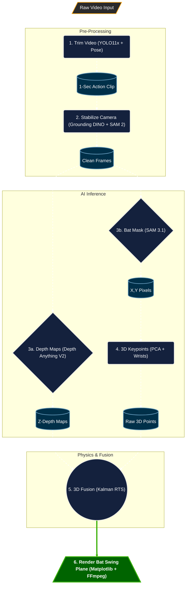
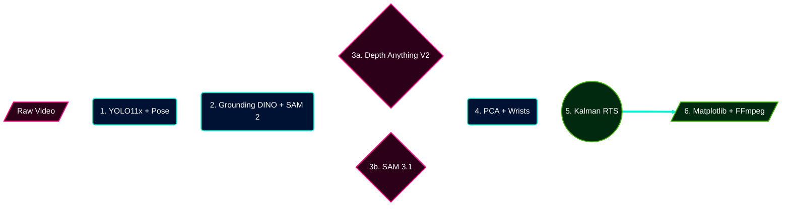
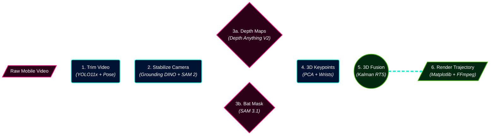
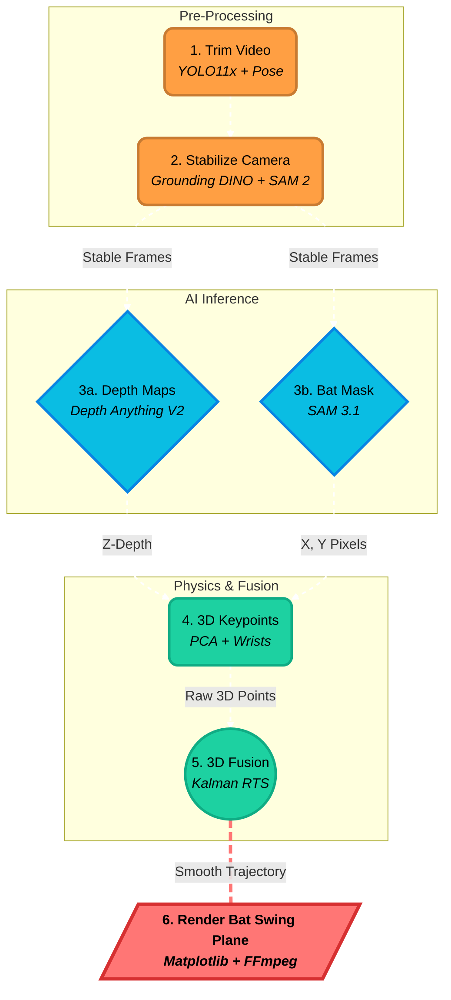
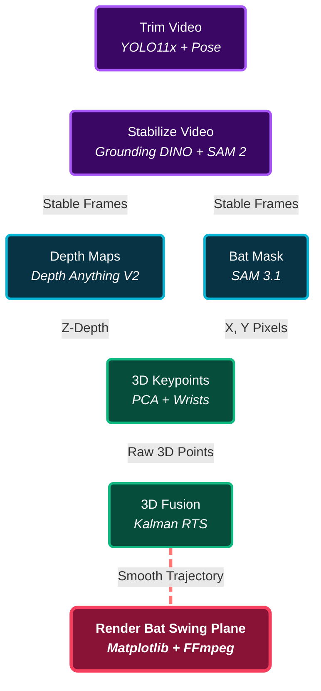
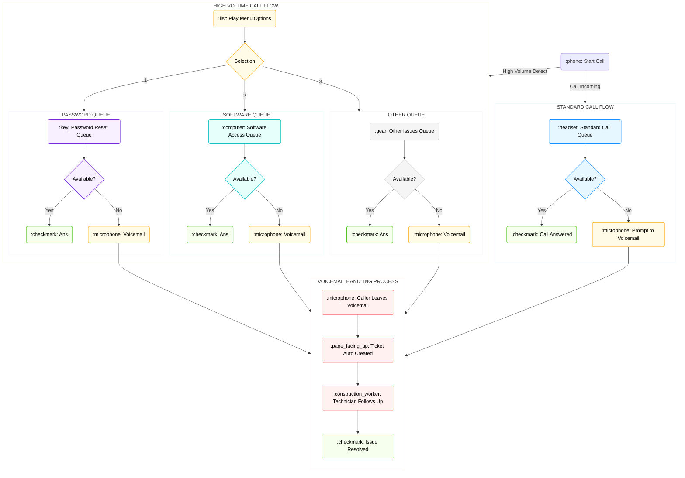

# Pipeline Diagram Options

Here are upgraded, premium-styled Mermaid diagrams for the Bat Swing Plane Pipeline. They use custom colors, rounded corners, and shapes to look significantly better than the default basic layout! 

*(Note: GitHub Markdown does not support standard CSS keyframe animations inside SVGs for security reasons. However, I have applied the `stroke-dasharray` technique which gives the connecting lines a dashed, "moving data" look in supported markdown renderers!)*

### Option 1: The "Premium" Dark Mode Flow
*Features custom hex colors, rounded corners, and drop shadows to look like a modern system architecture.*

---

### Option 2: The "Neon" Horizontal Layout
*Uses bright, high-contrast neon styling for a cyberpunk/AI feel, laid out left-to-right.*

---

### Option 3: The "Cyberpunk Detailed" Horizontal Layout
*An upgraded version of Option 2 that explicitly lists the technical models used at each step, ensuring perfect context for the pipeline while maintaining the premium neon aesthetic.*

---

### Option 4: The "Original Diagram" Upgraded
*This layout keeps the exact same structure as the original diagram in your blog draft (grouped by Pre-Processing, AI Inference, Physics), but significantly upgrades the visuals with bright colors, 3D shapes, and dashed flow paths (no emojis).*

---

### Option 5: The Uniform Layout
*This version uses the exact text and flow from Option 4 but simplifies all shapes into clean rectangles. The animation style uses the dashed strokes from Option 3, and the flow goes top-to-bottom.*

```mermaid
flowchart LR
    %% Clean, modern color palette for standard Markdown rendering
    classDef prep fill:#f0f4f8,stroke:#3b82f6,stroke-width:2px,color:#1e293b,rx:8px,ry:8px
    classDef infer fill:#f0fdf4,stroke:#10b981,stroke-width:2px,color:#1e293b,rx:8px,ry:8px
    classDef phys fill:#fffbeb,stroke:#f59e0b,stroke-width:2px,color:#1e293b,rx:8px,ry:8px
    classDef out fill:#fef2f2,stroke:#ef4444,stroke-width:3px,color:#1e293b,rx:12px,ry:12px,font-weight:bold

    %% Nodes and relationships (Text strictly preserved)
    T["Trim Video<br><i>YOLO11x + Pose</i>"]:::prep --> S["Stabilize Video<br><i>Grounding DINO + SAM 2</i>"]:::prep
    
    S -- "Stable Frames" --> D["Depth Maps<br><i>Depth Anything V2</i>"]:::infer
    S -- "Stable Frames" --> Seg["Bat Mask<br><i>SAM 3.1</i>"]:::infer
    
    D -- "Z-Depth" --> K["3D Keypoints<br><i>PCA for Bat Axis</i>"]:::phys
    Seg -- "X, Y Pixels" --> K
    
    K -- "Raw 3D Points" --> F["3D Fusion<br><i>Kalman RTS</i>"]:::phys
    
    F == "Smooth Trajectory" === R["Render Bat Swing Plane<br><i>Matplotlib + FFmpeg</i>"]:::out

    %% Link styling designed to be visible on any Markdown background
    linkStyle 0,1,2,3,4,5 stroke:#64748b,stroke-width:2px,stroke-dasharray: 5 5
    linkStyle 6 stroke:#ef4444,stroke-width:4px
```

# Comprehensive IT Support Call Flow

## Overview

This process log details the automated and human-agent handling paths for incoming calls to the IT support center. It illustrates both the Standard and High Volume call flows, with a specific focus on the complex decision branching during peak hours and the subsequent voicemail handling protocols.

## Process Flow Log (Vertical View)

This vertical diagram provides a step-by-step sequential view of the call handling process, stacked top-to-bottom for easy following as a 'log' of events.

---
**Standard Call Flow**
*A simple path where an available technician handles the call.*

*   **1. Start Call**
    *   *Description:* Call is initiated by the user.
*   **2. Standard Call Queue** (Group: STANDARD CALL FLOW)
    *   *Description:* Caller enters the general support queue for initial triaging or standard requests.
*   **3. Decision: Technician Available?**
    *   *Yes:* Call is immediately picked up. -> **[GO TO: Call Answered]**
    *   *No:* Wait time exists, and the user is offered a callback or voicemail option. -> **[GO TO: Prompt to Voicemail]**

---
**High Volume Call Flow**
*Detailed branching path for high call volumes, with menu-based routing to specialized agents.*

*   **4. Play Menu Options** (Group: HIGH VOLUME CALL FLOW)
    *   *Description:* Automated attendant plays initial greeting and main menu options.
*   **5. Decision: Menu Selection**
    *   **Selection 1: Password Reset** (Group: PASSWORD QUEUE)
        *   *Queue:* User enters the specialized Password Reset Queue.
        *   *Decision: Password Agent Available?*
            *   *Yes:* Call Answered -> **[GO TO: Call Answered]**
            *   *No:* Wait time exists. -> **[GO TO: Password Voicemail]**
    *   **Selection 2: Software Access** (Group: SOFTWARE QUEUE)
        *   *Queue:* User enters the specialized Software Access Queue.
        *   *Decision: Software Agent Available?*
            *   *Yes:* Call Answered -> **[GO TO: Call Answered]**
            *   *No:* Wait time exists. -> **[GO TO: Software Voicemail]**
    *   **Selection 3: Other Issues** (Group: OTHER QUEUE)
        *   *Queue:* User enters the generalized "Other Issues" Queue.
        *   *Decision: Other Agent Available?*
            *   *Yes:* Call Answered -> **[GO TO: Call Answered]**
            *   *No:* Wait time exists. -> **[GO TO: Other Voicemail]**

---
**Voicemail Handling Process**
*The standard back-end processing for all unserviced calls.*

*   **6. Caller Leaves Voicemail** (Group: VOICEMAIL HANDLING)
    *   *Inputs:* All 'No' outcomes from previous queues (Standard Voicemail, Password Voicemail, Software Voicemail, Other Voicemail) merge here.
    *   *Description:* User records their issue via the automated prompt.
*   **7. Ticket Auto Created**
    *   *Description:* The voicemail system triggers an automated service that generates an IT support ticket, attaching the audio file.
*   **8. Technician Follows Up**
    *   *Description:* A technician claims the ticket and contacts the user for resolution.
*   **9. Issue Resolved**
    *   *Description:* The issue is confirmed as fixed, and the ticket is closed.

## Mermaid Diagram Code

The following Mermaid.js code generates the vertical process diagram for use in compatible markdown editors and GitHub.

