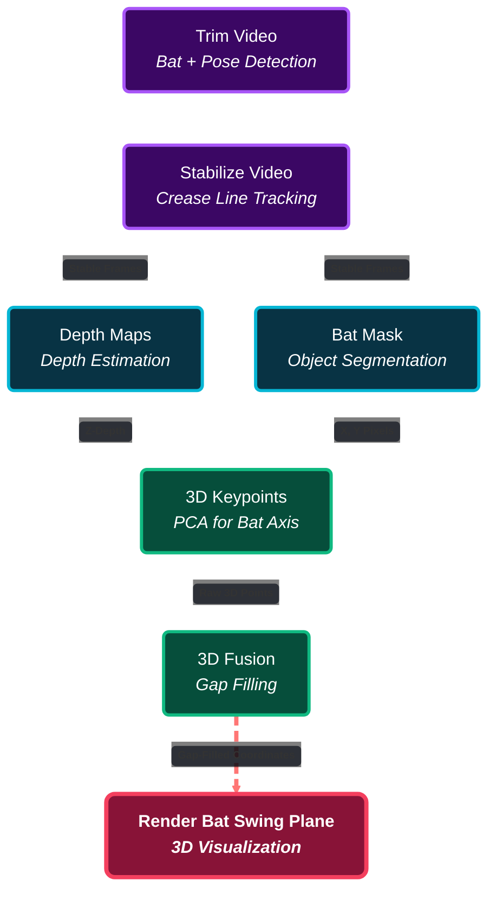
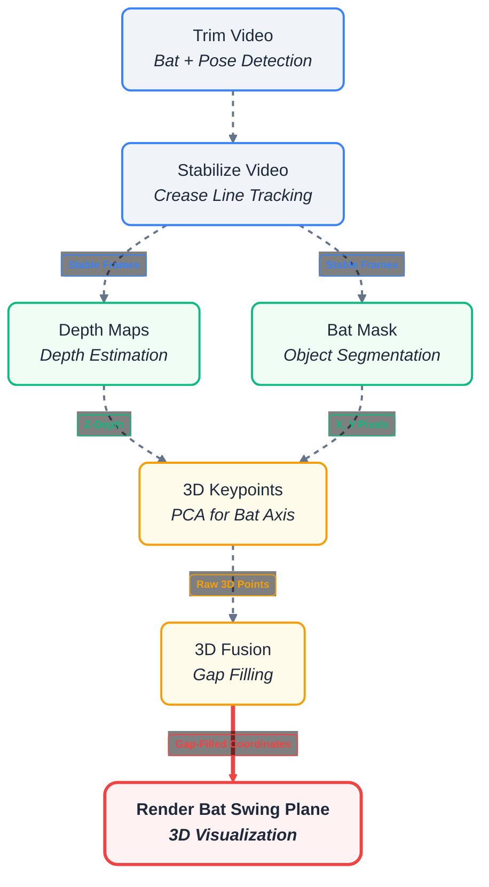
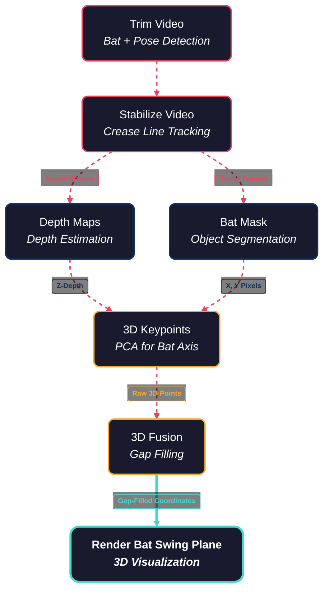
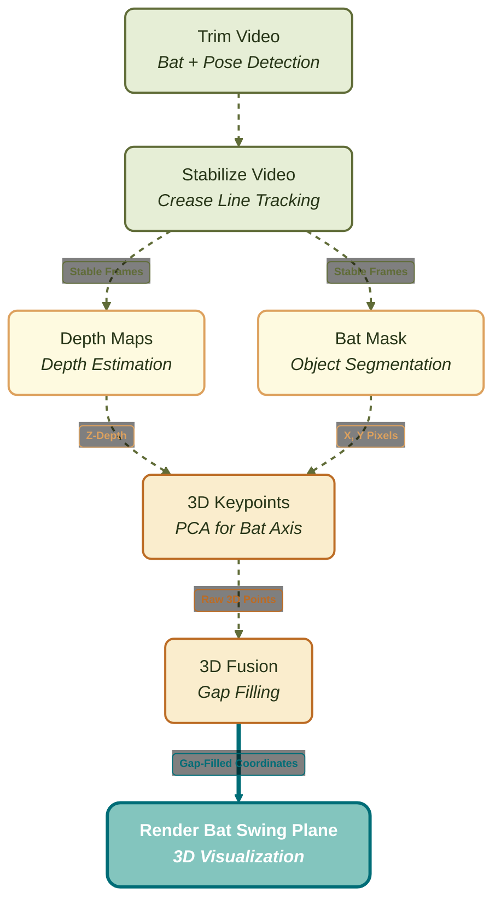
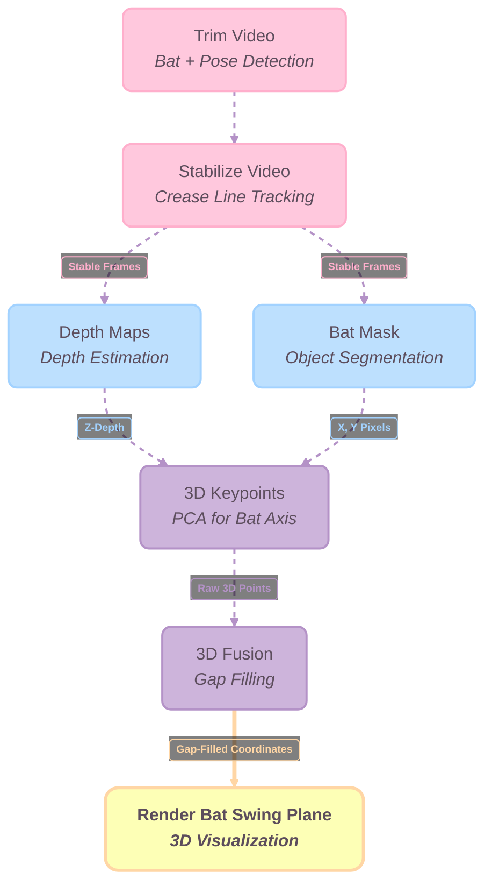
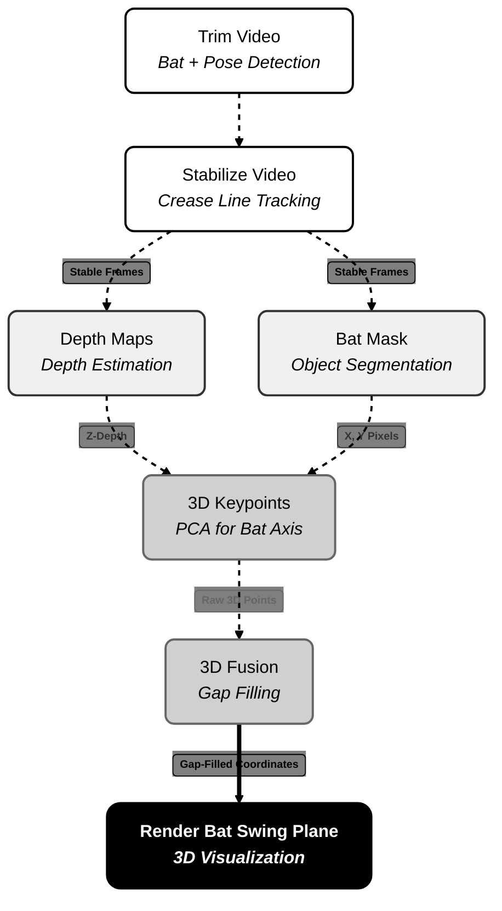
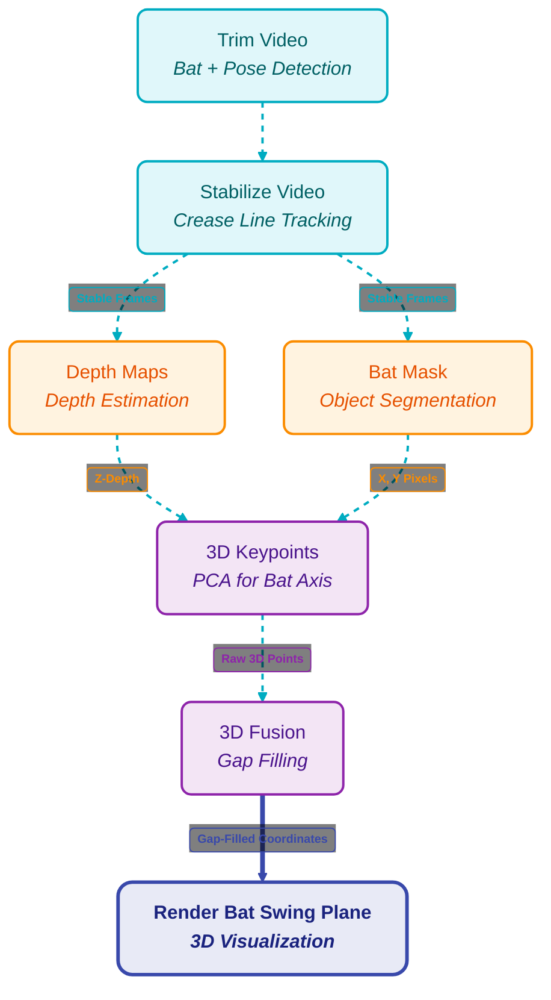
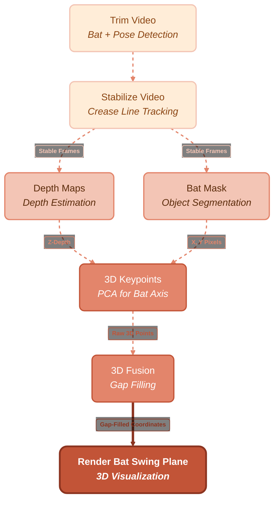
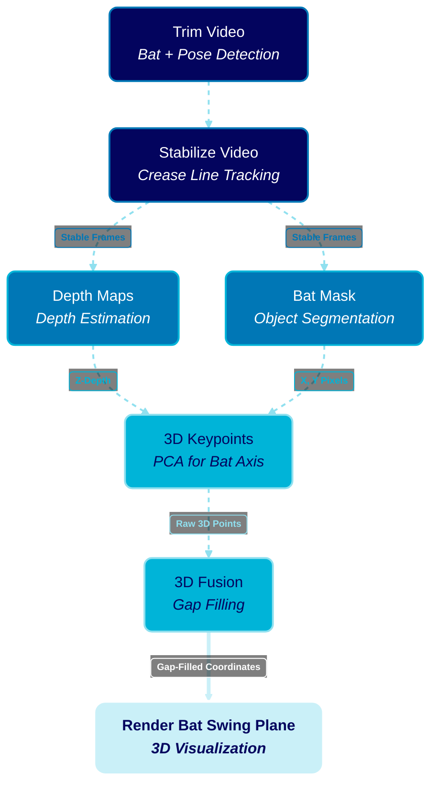

### Option 5: The Uniform Layout
*This version uses the exact text and flow from Option 4 but simplifies all shapes into clean rectangles. The animation style uses the dashed strokes from Option 3, and the flow goes top-to-bottom.*

### option 6

### Option 7: Cyberpunk Neon

### Option 8: Earthy Natural

### Option 9: Soft Pastel

### Option 10: Minimalist Monochrome

### Option 11: Vibrant Tech

### Option 12: Autumn Sunset

### Option 13: Midnight Ocean

