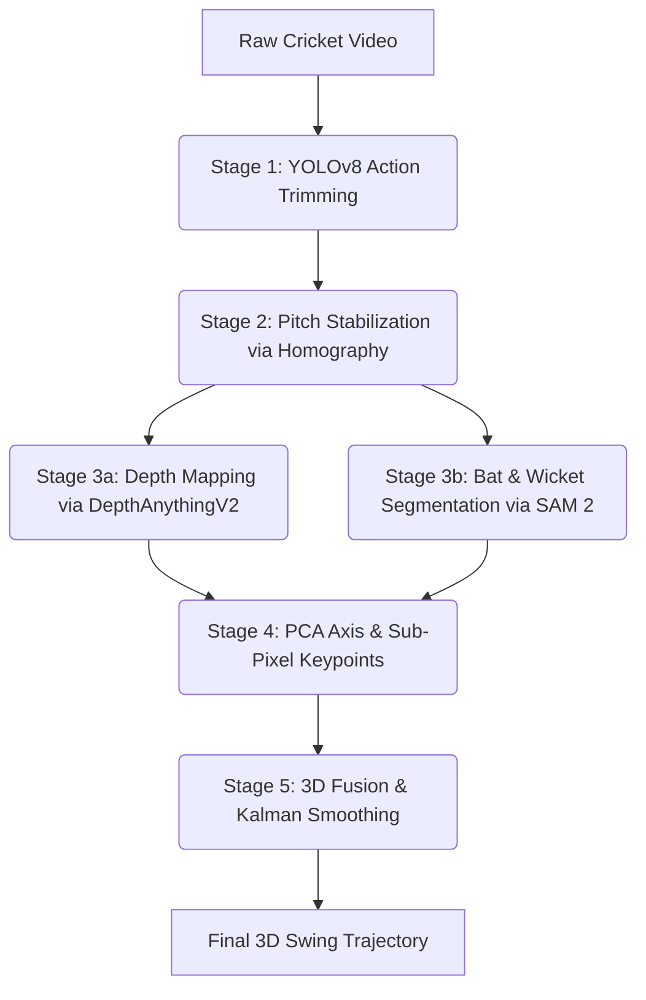
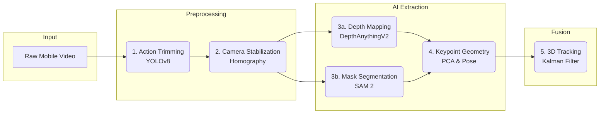
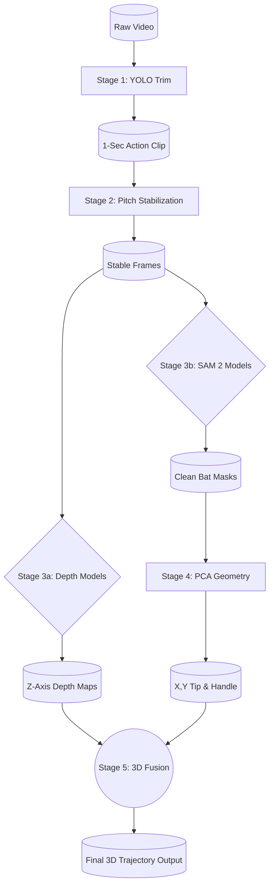

# Pipeline Diagram Options

Here are three different styles of Mermaid diagrams illustrating the Bat Swing Plane Pipeline. You can copy the code block for your favorite one and paste it directly into your blog, or we can use it to build a visual graphic!

### Option 1: The Classic Top-Down Flow
*Simple, easy to read, and shows the direct chronological steps of the pipeline.*

---

### Option 2: The Horizontal System Architecture
*Grouped by logical phases (Preprocessing, AI Extraction, Fusion). Great for technical architecture sections.*

---

### Option 3: The "Data Flow" Layout
*Focuses heavily on the actual data structures being produced at each step (cylinders) rather than just the actions.*

