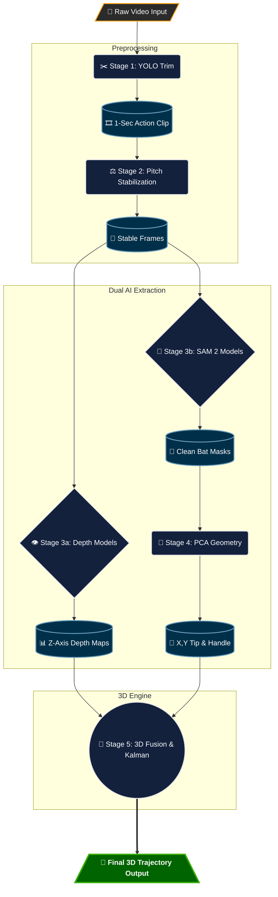
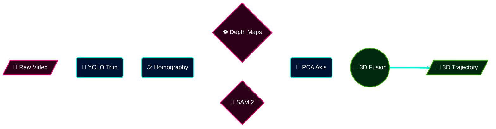

# Pipeline Diagram Options

Here are upgraded, premium-styled Mermaid diagrams for the Bat Swing Plane Pipeline. They use custom colors, rounded corners, shapes, and emojis to look significantly better than the default basic layout! 

*(Note: GitHub Markdown does not support animated SVGs or animated Mermaid diagrams for security reasons. If you want a truly animated diagram, you would need to export a GIF from a tool like Canva or Figma. However, these styled diagrams are the absolute best looking static ones you can get purely through code!)*

### Option 1: The "Premium" Dark Mode Flow
*Features custom hex colors, rounded corners, drop shadows, and emojis to look like a modern system architecture.*

---

### Option 2: The "Neon" Horizontal Layout
*Uses bright, high-contrast neon styling for a cyberpunk/AI feel, laid out left-to-right.*

